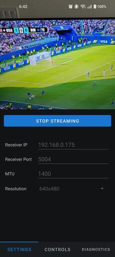

# Mobstr

Mobstr, short for Mobile Stream, is an Android application that streams a smartphone’s camera feed to a PC on the local network. Its purpose is to make camera hardware more accessible for computer vision developers by eliminating the need for dedicated devices.

> :warning: This project is still under development!

## Features

- Stream camera to PC over RTP
- Control camera parameters such as exposure, ISO, etc.
- Low latency (<200ms on Wi-Fi)

## Coming Soon
- Diagnostics (frame rate, bandwidth, etc.)
- More camera controls
- Multicast

## Installation

Clone the repo and build the application with Android Studio.